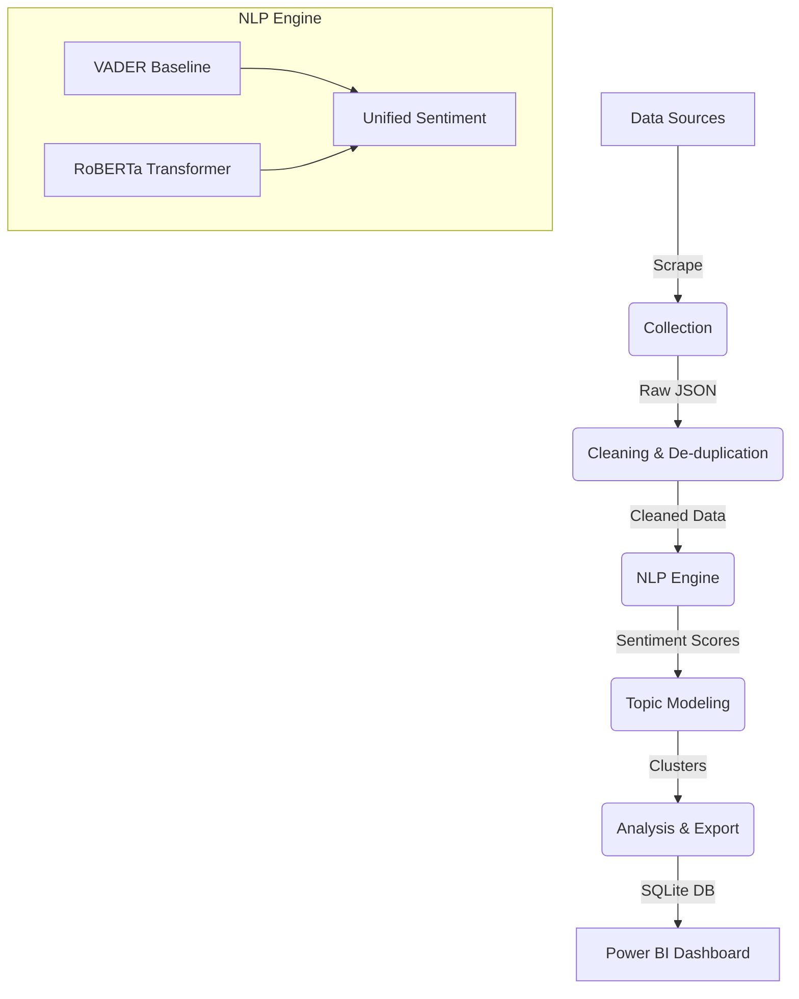

#  News Sentiment Intelligence Dashboard

[](https://www.python.org/)
[](https://www.sqlite.org/)
[](https://huggingface.co/transformers/)
[](LICENSE)

An end-to-end data intelligence pipeline designed to scrape, clean, and analyze global news articles. This project transforms raw unstructured text into actionable sentiment insights, topic clusters, and statistical event comparisons, perfectly optimized for Power BI visualization.

---

##  Key Features

*   **Multi-Source Scraper**: Automated collection from GDELT (bulk historical) and GNews (real-time).
*   **Advanced NLP Suite**: Combines VADER for baseline sentiment with **RoBERTa-based Transformers** for deep contextual analysis.
*   **Topic Modeling**: Intelligent article clustering using **BERTopic** to identify emerging narratives.
*   **Statistical Analysis**: Automated T-testing for sentiment shifts around major global events.
*   **Power BI Ready**: Generates a relational SQLite schema (`app.db`) optimized for interactive dashboards.

---

##  project Architecture



---

##  Installation

1. **Clone the repository:**
   ```bash
   git clone https://github.com/AMAANL/news_sentiment-analysis.git
   cd news_sentiment-analysis
   ```

2. **Set up virtual environment:**
   ```bash
   python -m venv venv
   source venv/bin/activate  # On Windows: venv\Scripts\activate
   ```

3. **Install dependencies:**
   ```bash
   pip install -r requirements.txt
   ```

---

##  Usage

The pipeline is managed via a single orchestration script `run_pipeline.py`.

### Run Full Pipeline
To execute the entire workflow from scraping to SQL export:
```bash
python run_pipeline.py --all
```

### Run Specific Stages
| Flag | Description |
| :--- | :--- |
| `--collect` | Scrape recent and historical news (GDELT/GNews) |
| `--clean` | Date normalization and MinHash LSH deduplication |
| `--nlp` | RoBERTa-based sentiment analysis |
| `--topic` | BERTopic modeling for narrative clustering |
| `--export` | Calculate statistical metrics and sync to SQLite |

---

## 📈 Power BI Integration

The pipeline outputs `data/db/app.db`. To visualize:

### 1. Prerequisite: SQLite ODBC Driver
Windows users **must** install the [SQLite ODBC Driver](http://www.ch-werner.de/sqliteodbc/) to connect Power BI to the database.

### 2. Connection Steps
1. Create a **64-bit ODBC System DSN** (e.g., `NewsSentimentDSN`) pointing to `data/db/app.db`.
2. In Power BI, select **Get Data** > **ODBC** > **NewsSentimentDSN**.
3. Load the `articles`, `daily_sentiment_aggregation`, and `events` tables.

### 3. Recommended Visuals
*   **Sentiment Volatility**: Line chart of `avg_sentiment` vs `published_date`, sliced by `topic`.
*   **Narrative Dominance**: Stacked bar chart showing article volume over time.
*   **Event Impact**: Use the `events` table to compare pre/post event sentiment means.

---

##  Repository Structure

- `src/`: Core logic (collection, NLP, modeling, cleaning).
- `data/`: Storage for raw, cleaned, and processed datasets (ignored in Git).
- `run_pipeline.py`: Main entry point.
- `requirements.txt`: Python dependencies.

---

##  License
Distributed under the MIT License. See `LICENSE` for more information.

---
*Developed by [AMAANL](https://github.com/AMAANL)*
